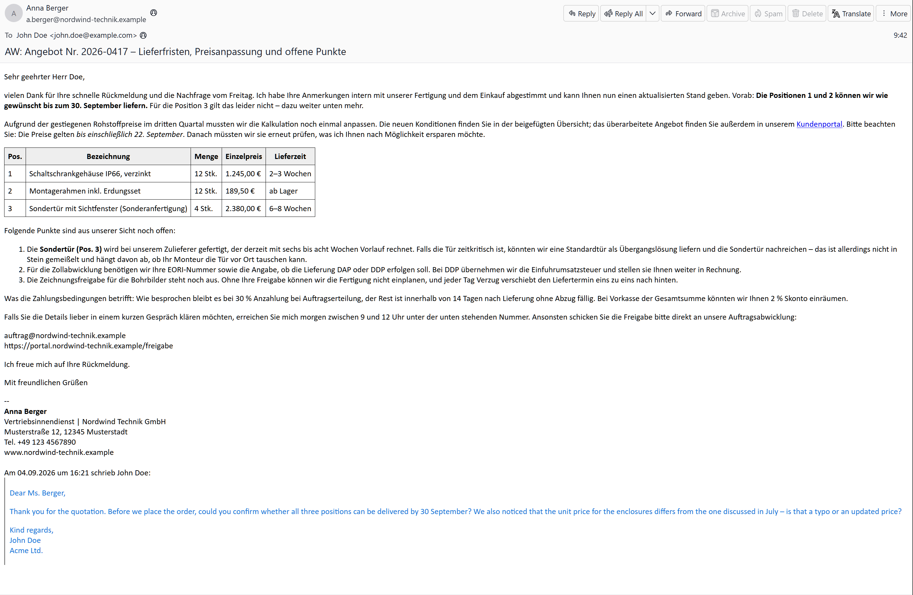
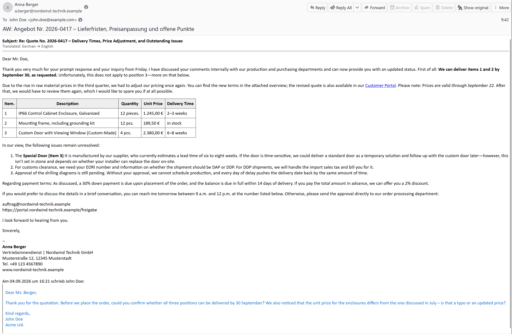
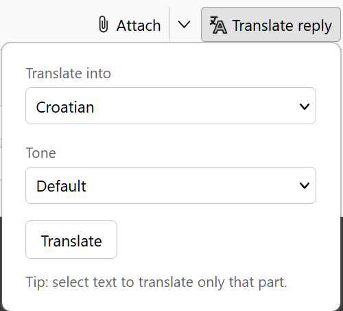
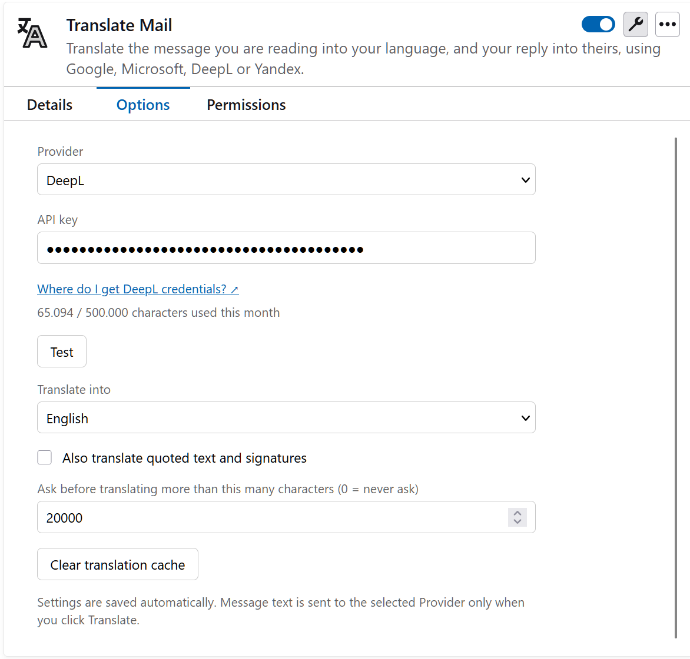

# Translate Mail

Thunderbird add-on (128+) that translates the message you are reading into your language, and your reply into theirs. Bring your own API key for DeepL, Microsoft Translator, Google Cloud Translation or Yandex Translate.

[Install from addons.thunderbird.net](https://addons.thunderbird.net/thunderbird/addon/translate-mail/)





## Reading

- **Translate** in the message header toolbar (or **Ctrl+Shift+X**) translates subject and body in place. Click again (**Show original**) to switch back.
- **Translate selection** in the right-click menu translates only the selected part, quoted text included.
- Quoted replies, signatures and forwarded-message headers are skipped by default so they do not eat quota. Enable **Also translate quoted text and signatures** in the settings to include them.
- Hard-wrapped lines in plain-text messages are joined before translation so sentences are not translated as fragments. Lines shorter than 40 characters, indented lines and list items are left alone.
- Translations are cached locally (200 most recent), so reopening a message is free.

## Replying



- **Translate reply** in the compose toolbar (or **Ctrl+Shift+E**) translates what you wrote into the language of the message you are answering. The language is preselected when you translated that message.
- Select some text first to translate only that.
- Your text is sent as HTML, so bold text and links stay in place and sentences are translated whole. Quoted text, your signature, bare links and e-mail addresses are left alone. The subject is not touched.
- The translation goes through the editor, so **Ctrl+Z** undoes it.
- With DeepL, the popup also offers a **Tone** (Default / Formal / Informal), remembered for the next reply.

## Settings



| Provider | Credentials | Free tier |
|---|---|---|
| DeepL | https://www.deepl.com/pro-api → API key (free keys end in `:fx`) | 500 000 chars/month |
| Microsoft Translator | Azure portal → Translator resource → key + region | 2 000 000 chars/month (F0) |
| Google Cloud Translation | Google Cloud console → enable Cloud Translation API → API key | 500 000 chars/month with billing enabled |
| Yandex Translate | Yandex Cloud console → service account API key + folder ID | trial grant only |

- Message text is sent to the selected Provider **only when you click Translate**.
- Translating more than 20 000 characters at once asks first. Adjust the threshold in the settings, 0 turns it off.
- With DeepL the settings show how much of this month's quota is used.
- Not every Provider supports every target language. Unsupported combinations show the Provider's error in a popup.
- Shortcuts can be changed under Add-ons and Themes → gear → Manage Extension Shortcuts.

## Development

```
npm test                    # unit tests (node --test)
python scripts/package.py   # writes translate-mail-<version>.xpi
```

Load unpacked: Add-ons and Themes → gear → **Debug Add-ons** → **Load Temporary Add-on** → `manifest.json`. Then open the add-on's Preferences, pick a Provider and paste a key.

Test the packaged `.xpi` via Add-ons and Themes → gear → **Install Add-on From File**; toolbar icons render differently in a temporary load. The manual checklist is in [docs/smoke-test.md](docs/smoke-test.md), and [images/sample-email.eml](images/sample-email.eml) is a demo message (File → Open → Saved Message).

`package.py` zips `icons/`, `_locales/` and `src/` wholesale, so keep non-runtime assets out of those directories. PowerShell's `Compress-Archive` is avoided on purpose: it writes backslash entry names, which Thunderbird rejects.

Layout:

| Path | What |
|---|---|
| `src/background.js` | toolbar buttons, commands, orchestration |
| `src/content.js` | in-place translation of the message view and compose editor |
| `src/providers.js` | DeepL, Microsoft, Google, Yandex clients |
| `src/text.js` | segmenting, skip rules, line joining |
| `src/cache.js` | local translation cache |
| `src/languages.js` | target language list |
| `src/theme.js` | follow Thunderbird's theme colours on extension pages |
| `src/options.*`, `src/compose.*`, `src/dialog.*` | settings page, reply popup, error window |
| `_locales/` | UI strings |
